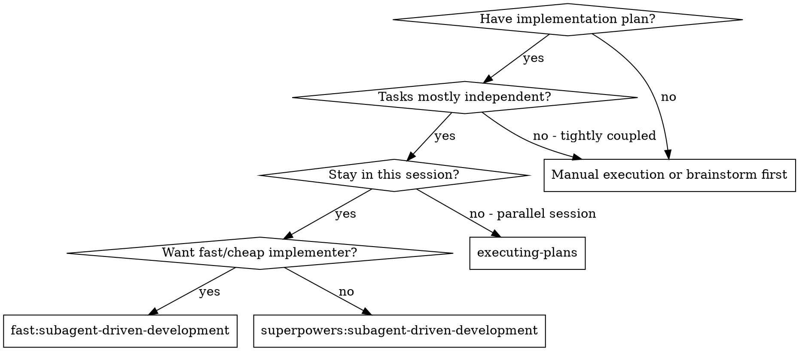
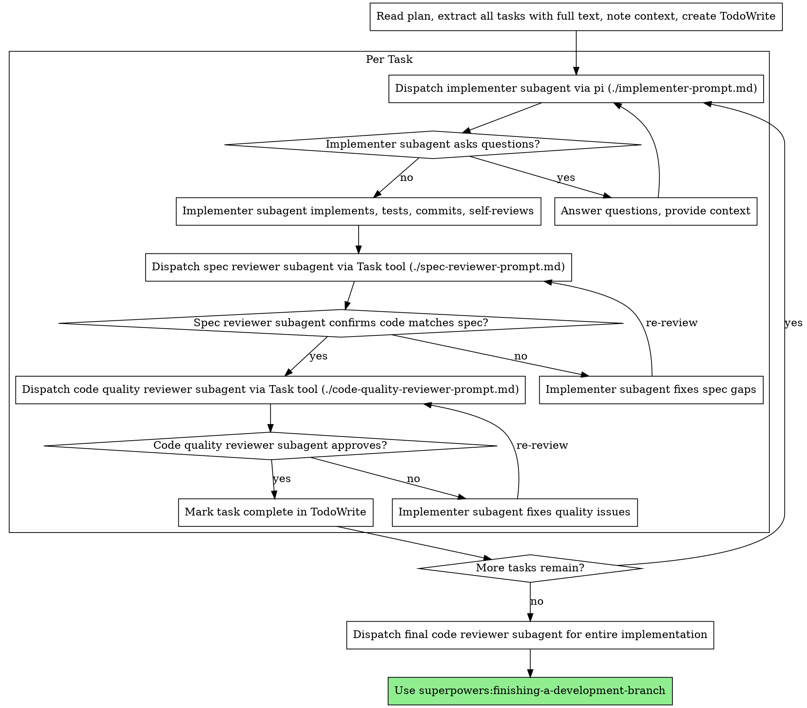

<!-- Kept in sync with superpowers:subagent-driven-development as of 2026-05-16 -->

# Subagent-Driven Development (Fast)

Execute plan by dispatching fresh subagent per task, with two-stage review after each: spec compliance review first, then code quality review.

**Implementer subagents are dispatched via `pi -p`** (fast, mechanical). **Spec and code-quality reviewers continue to use the orchestrator's native Task tool** (stronger reasoning catches issues better).

**Why subagents:** You delegate tasks to specialized agents with isolated context. By precisely crafting their instructions and context, you ensure they stay focused and succeed at their task. They should never inherit your session's context or history — you construct exactly what they need. This also preserves your own context for coordination work.

**Core principle:** Fresh subagent per task + two-stage review (spec then quality) = high quality, fast iteration

**Continuous execution:** Do not pause to check in with your human partner between tasks. Execute all tasks from the plan without stopping. The only reasons to stop are: BLOCKED status you cannot resolve, ambiguity that genuinely prevents progress, or all tasks complete. "Should I continue?" prompts and progress summaries waste their time — they asked you to execute the plan, so execute it.

## When to Use



**vs. `superpowers:subagent-driven-development`:**
- Implementer subagents run via `pi -p` (cheaper, faster, mechanical model)
- Reviewer subagents unchanged (still Task tool, strong model)
- Pick this variant when implementer tasks are mechanical and well-specified

## The Process



## Model Selection

**Implementer:** Model is fixed — whatever `pi` is configured to use. No per-task triage needed.

**Reviewers (spec compliance, code quality):** Use the orchestrator's native model-selection guidance. Stronger reasoning catches more issues, and reviewers run only twice per task (cost is small compared to implementer iterations).

**Final code reviewer (after all tasks):** Most capable model available.

## Handling Implementer Status

Implementer subagents report one of four statuses. Handle each appropriately:

**DONE:** Proceed to spec compliance review.

**DONE_WITH_CONCERNS:** The implementer completed the work but flagged doubts. Read the concerns before proceeding. If the concerns are about correctness or scope, address them before review. If they're observations (e.g., "this file is getting large"), note them and proceed to review.

**NEEDS_CONTEXT:** The implementer needs information that wasn't provided. Provide the missing context and re-dispatch.

**BLOCKED:** The implementer cannot complete the task. Assess the blocker:
1. If it's a context problem, provide more context and re-dispatch via pi
2. If the task requires more reasoning than pi can handle, fall back to dispatching the implementer via the Task tool (escape hatch to a stronger model)
3. If the task is too large, break it into smaller pieces
4. If the plan itself is wrong, escalate to the human

**Never** ignore an escalation or retry pi-dispatch without changes. If the implementer said it's stuck, something needs to change — and a stronger model is a valid lever when pi has reached its ceiling.

## Prompt Templates

- `./implementer-prompt.md` - Dispatch implementer subagent via `pi -p`
- `./spec-reviewer-prompt.md` - Dispatch spec compliance reviewer subagent via Task tool
- `./code-quality-reviewer-prompt.md` - Dispatch code quality reviewer subagent via Task tool

## Example Workflow

```
You: I'm using fast:subagent-driven-development to execute this plan.

[Read plan file once: docs/superpowers/plans/feature-plan.md]
[Extract all 5 tasks with full text and context]
[Create TodoWrite with all tasks]

Task 1: Hook installation script

[Get Task 1 text and context (already extracted)]
[Write prompt body to $TMPDIR/pi-task-1-hook-install.md]
[Run: pi -p "$(cat $TMPDIR/pi-task-1-hook-install.md)"]

Implementer (pi): "Before I begin - should the hook be installed at user or system level?"

You: "User level (~/.config/superpowers/hooks/)"

[Re-dispatch with answer appended to the prompt file]
Implementer (pi):
  - Implemented install-hook command
  - Added tests, 5/5 passing
  - Self-review: Found I missed --force flag, added it
  - Committed
  Status: DONE

[Dispatch spec compliance reviewer via Task tool]
Spec reviewer: ✅ Spec compliant - all requirements met, nothing extra

[Get git SHAs, dispatch code quality reviewer via Task tool]
Code reviewer: Strengths: Good test coverage, clean. Issues: None. Approved.

[Mark Task 1 complete]

...
```

## Advantages

**vs. `superpowers:subagent-driven-development`:**
- Implementer runs on a cheaper, faster model (pi-configured)
- Strong reasoning preserved for reviewers (where it catches the most issues)
- Mechanical work goes to the mechanical-tier model

**Cost:**
- Same orchestration cost (controller does same prep work)
- Implementer iterations are much cheaper
- Pi may need more iterations than a stronger model for ambiguous tasks — be ready to fall back

## Red Flags

**Never:**
- Start implementation on main/master branch without explicit user consent
- Skip reviews (spec compliance OR code quality)
- Proceed with unfixed issues
- Dispatch multiple implementation subagents in parallel (conflicts)
- Make subagent read plan file (provide full text instead)
- Skip scene-setting context (subagent needs to understand where task fits)
- Ignore subagent questions (answer before letting them proceed)
- Accept "close enough" on spec compliance (spec reviewer found issues = not done)
- Skip review loops (reviewer found issues = implementer fixes = review again)
- **Start code quality review before spec compliance is ✅** (wrong order)
- Move to next task while either review has open issues
- **Pipe untrusted task text directly into `pi -p` as a quoted argument.** Always write the prompt body to a tempfile under `$TMPDIR` and pass via `"$(cat <tmpfile>)"` to avoid shell-escaping bugs with backticks, quotes, and code fences.
- Fall back to Task tool for the implementer silently — if pi is repeatedly failing on a task, surface that and either retry with more context, escalate to Task tool deliberately, or break the task down.

**If subagent asks questions:**
- Answer clearly and completely
- Provide additional context if needed
- Don't rush them into implementation

**If reviewer finds issues:**
- Re-dispatch implementer (via pi) with specific fix instructions
- Reviewer reviews again
- Repeat until approved
- Don't skip the re-review

**If subagent fails task:**
- Re-dispatch with specific instructions (don't fix manually — context pollution)
- If pi keeps failing on the same task, escalate to Task tool implementer or break the task down

## Integration

**Required workflow skills:**
- **superpowers:using-git-worktrees** - Ensures isolated workspace (creates one or verifies existing)
- **superpowers:writing-plans** - Creates the plan this skill executes
- **superpowers:requesting-code-review** - Code review template for reviewer subagents
- **superpowers:finishing-a-development-branch** - Complete development after all tasks

**Implementer subagents are dispatched via the `pi` CLI** (see `./implementer-prompt.md`). Reviewer subagents run via the orchestrator's native Task tool (see the two reviewer prompt templates).

**Subagents should use:**
- **superpowers:test-driven-development** - Subagents follow TDD for each task

**Alternative workflow:**
- **superpowers:subagent-driven-development** - Use when implementer needs the orchestrator's stronger model
- **superpowers:executing-plans** - Use for parallel session instead of same-session execution
